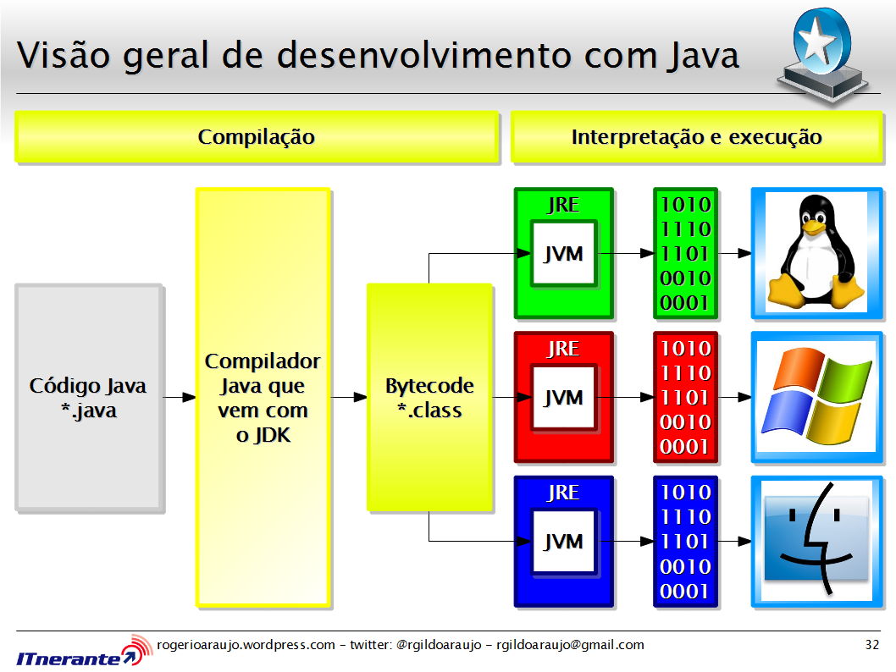
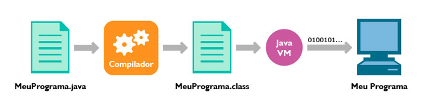
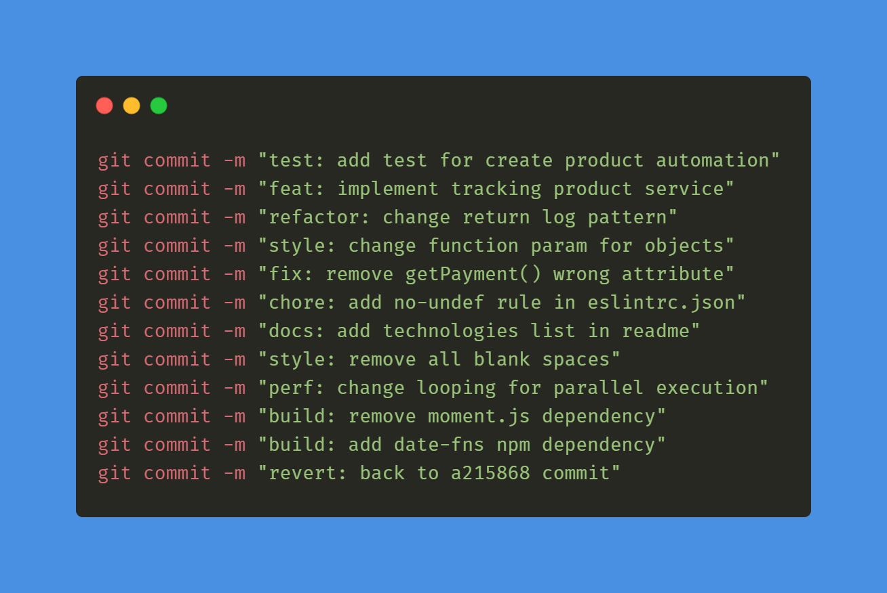
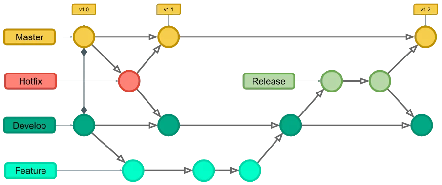

# Java

Informações gerais

---
No java escrevemos nosso codigo, 
o compilador transforma o arquivo .java em arquivo .Bytecode, 
o jvm le o .Bytecode (que pode ser lido por multiplantaformas)

  
    
  
  
processo de compilação java

Public static void main() -> ponto de entrada (para executar codigo, n sao todos que vão usar)
- abreviação: psvm

Public static void main() -> ponto de entrada (para executar codigo, n sao todos que vão usar
- abreviação: psvm

## Tipos primitivos:
- int 
- long - muitos int
- double - muitos float
- float 
- byte
- short
- boolean
- char

## Objeto: 
[voce consegue fazer manipulações nele]
- String
- System
- Integer

# Git

## Padrão de commits

  

## Git Flow
[Explicação](https://www.alura.com.br/artigos/git-flow-o-que-e-como-quando-utilizar?srsltid=AfmBOorbviid7ZdA63kubdyU4VyepnHI3M1ODQDgwcLbMRvdxTjIIzVf)

O novo desenvolvimento (como novas funcionalidades e correções de bugs não emergenciais) é feito em Branches de features e só é mesclado de volta ao corpo principal do código quando as pessoas desenvolvedoras estão seguras de que o código está pronto para lançamento.

  
  
ggerenciamento de versões de produção

