# Todos os conceitos de POO

## Classes e Objetos

<div align="center">
  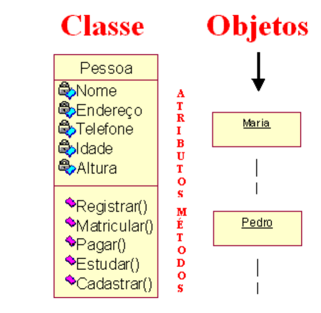
</div>

```Java
Class Pessoa{
    String nome;
    char sexo;
    int idade;
    String cpf;
}

public static void main(String[] args) {
    Pessoa p1 = new Pessoa();
    p1.nome = "Hilario";
    p1.cpf = "123.456.789-00";
    p1.idade = 18;
    p1.sexo = "M";
}
```

## Metodos 

Função dentro da classe

<div align="center">
  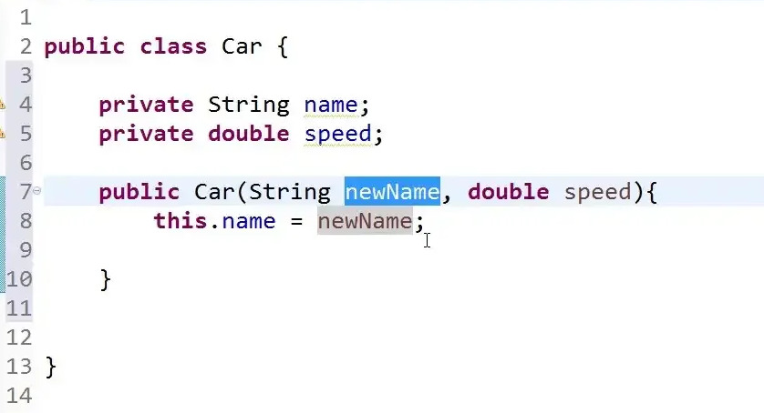
</div>

```java
public class Pessoa {
  // Campos
  private String nome;
  private int idade;

  // Métodos
  public void saudacao() {
    System.out.println("Olá, meu nome é " + nome + " e tenho " + idade + " anos.");
  }

  public static void main(String[] args) {
    Pessoa pessoa1 = new Pessoa("João", 30);
    pessoa1.saudacao();
  }
}
```

#### Reescrita de Metodos (Overrid)

<div align="center">
  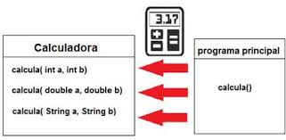
  <br><br>
  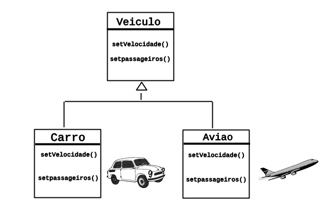
</div>

#### [Sobrecarga de Metodos (Overload)](https://www.devmedia.com.br/sobrecarga-e-sobreposicao-de-metodos-em-orientacao-a-objetos/33066)
<div align="center">
  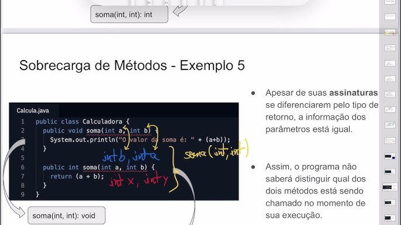
</div>

```java
public class calculadora{
 public int calcula( int a, int b){
    return a+b;
  }
  public double calcula( double a, double b){
     return a+b;
  }
   public String calcula( String a, String b){
     return a+b;
}
```

#### Basicamente
<div align="center">
  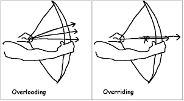
</div>

## Construtores

```java
// No main
Pessoa p1 = new Pessoa("Joao", 21)
```

```java
public class Pessoa {
  // Campos
  private String nome;
  private int idade;

  // Construtor
  public Pessoa(String nome, int idade) {
    this.nome = nome;
    this.idade = idade;
  }
```

## [Herança](https://porloca.wordpress.com/2011/06/28/ontem-hoje-e-sempre/) 

<div align="center">
  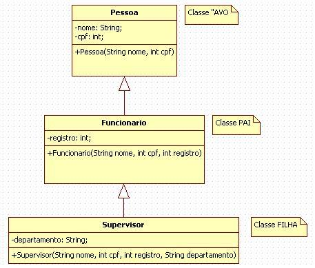
  <br><br>
  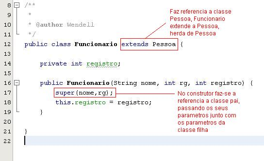
  <br><br>
  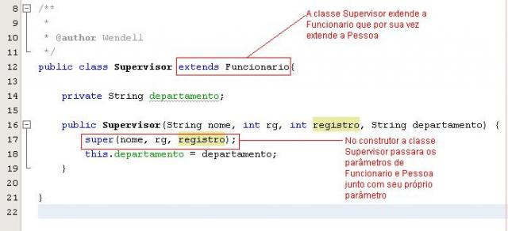
</div>

## [Encapsulamento](https://www.linkedin.com/posts/augusto-galego_curso-completo-de-estruturas-de-dados-e-algoritmos-activity-7435670534727794689-vtNO?utm_source=social_share_send&utm_medium=member_desktop_web&rcm=ACoAAEbPii8Byh5CC1NUr5cEQktGTf-VMxOgaag)
A prática de esconder os detalhes de implementação de uma classe, e expor apenas uma interface pública para interagir com ela. Isso significa que os atributos de uma classe devem ser privados e o acesso a eles deve ser feito somente por meio de métodos públicos.

```java
public class Pessoa {
    private String nome;
    private int idade;

    public String getNome() {
        return nome;
    }

    public void setNome(String nome) {
        this.nome = nome;
    }

    public int getIdade() {
        return idade;
    }

    public void setIdade(int idade) {
        this.idade = idade;
    }
}
```
<div align="center">
  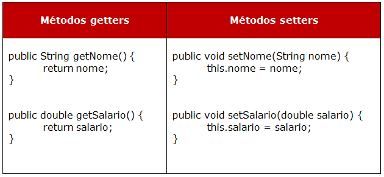
</div>

### Modificadores de acesso

- public
- private: somente acessa esse valor na mesma class
- protect: pode acessa o valor em outra class somente do mesmo pacote
- default/nada: nao é visto fora do pacote dele

<div align="center">
  
  <br><br>
  
</div>

## [Array/ArrayList](https://www.dio.me/articles/funcoes-em-java-conhecendo-o-arraylist) 
[Video](https://youtu.be/d59yoampHX0?si=sunl9wXbvU3dGIcL)

Array: Lista de tamanhos definidos, precisa de uma variavel extra salvando o local de cada elemento da lista
- mais simples, menos espaço, necessita do indice

ArrayList: se encaixa melhor numa lista de tamanho indefinido

```java
import java.util.ArrayList;

public class AgendaTelefonica {
    public static void main(String[] args) {
        
        // uma lista "agenda" do tipo da class "Contato"
        ArrayList<Contato> agenda = new ArrayList<>();
    
        for(Contato c : agenda) {
            c.nome;
        }
    }
}
```
<div align="center">
  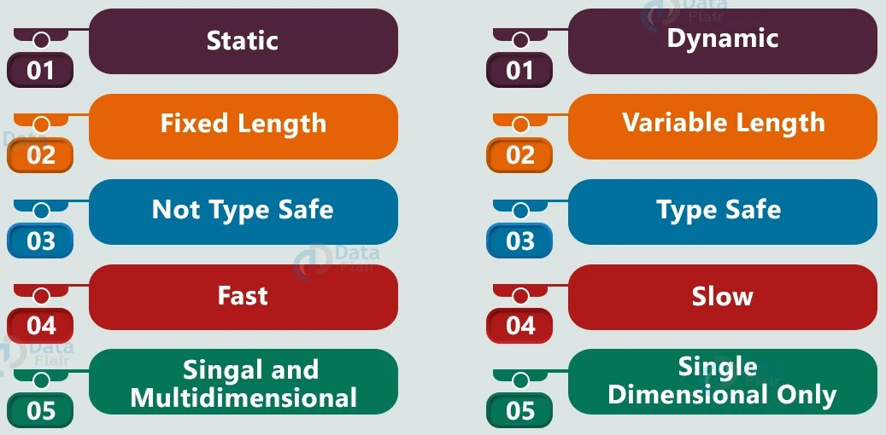
</div>

## [Tratamento de Erros e Exceções](https://www.dio.me/articles/dominando-try-e-catch)
```java
public class ExemploTryCatch {

    public static void main(String[] args) {
        try {
            int resultado = dividir(10, 0);
            System.out.println("Resultado: " + resultado);
        } catch (ArithmeticException e) {
            System.err.println("Erro: Divisão por zero");
        } finally {
            // executa sempre, 
            // mesmo que nenhuma excessão seja lancada ou 
            // mesmo que o programa aborte !
        }
    }

    public static int dividir(int numerador, int denominador) {
        return numerador / denominador;
    }
}
```

## Conceitos

### Poliforfismo
O objeto pode assumir várias formas diferentes

### Class Abstract
Ser como uma classe base para todas as classes 
que herdarem dela

```java
public abstract class Conta {
    // Um intermediario entre as class
    
    protected String numero;
    protected Pessoa titular;
    protected double saldo;
    protected Data criacao;
    protected Gerente gerente;

    /* Construtores podem permanecer. Inicializam
       os atributos da classe e sao chamados
       pelas subclasses. */

    // Metodo abstrato:
    // aqui ele não é implementado,
    // mas nas subclasses ele será
    public abstract double disponivel();

    // Metodos concretos:
    public boolean sacar(double valor) {
        if (valor <= this.disponivel()) {
            this.setSaldo(this.getSaldo() - valor);
            return true;
        }
        else {
            return false;
        }
    }

    // Demais metodos...
}
```

### Interface
Entidade que defini um conjunto de 
metodos que um conjunto de clases seram
obrigadas a implementar
- todos os metodos devem ser abstratos

## [Coleções, Ordenação e Comparação](https://youtu.be/MWsJT6nbLz4?si=GVAcN8VU-_9QuXhO)
Estrutura de dados que permiti armazenar 
varios objetos 
- Listas
- Conjuntos
- Mapas

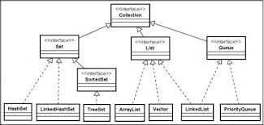

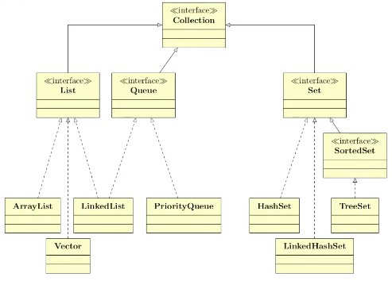


## Entrada de Dados
```java
import java.util.Scanner; // 1. Importar a classe Scanner

public class EntradaDados {
    public static void main(String[] args) {
        Scanner sc = new Scanner(System.in); // 2. Instanciar o Scanner
        
        System.out.print("Digite seu nome: ");
        String nome = sc.nextLine(); // 3. Ler String
        
        System.out.print("Digite sua idade: ");
        int idade = sc.nextInt(); // 4. Ler Inteiro
        
        System.out.println("Olá " + nome + ", você tem " + idade + " anos.");
        
        sc.close(); // 5. Fechar o Scanner
    }
}
```

## [Persistência em arquivos](https://youtu.be/cA-Z9y2J-6A?si=jvNTYi8ALwfZTFxd)

<div align="center">
  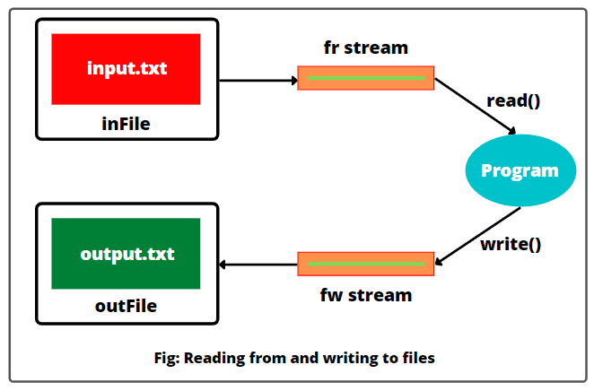
</div>

```java
public void salvarClientesArq() {
    try {
        FileWriter f = new FileWriter("clientes.txt");
        BufferedWriter b = new BufferedWriter(f);

        b.write(this.clientes.size() + "\n");

        for (Pessoa titular : this.clientes) {
            // função onde vai salvar os 
            // metodos do titular
            titular.salvarArq(b);
        }

        b.close();
    }
    catch (IOException e) {
        System.out.println("Erro ao salvar o arquivo");
    }
}
```
