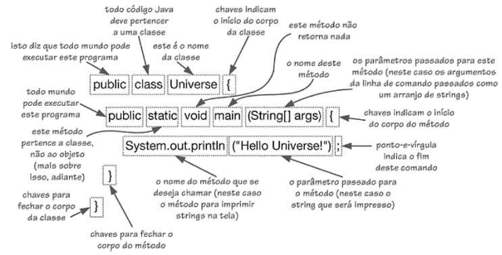
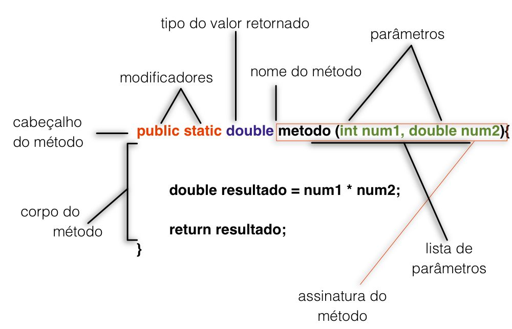
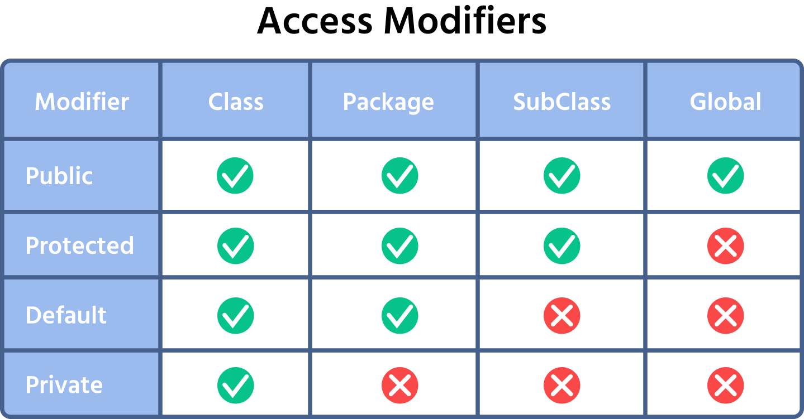
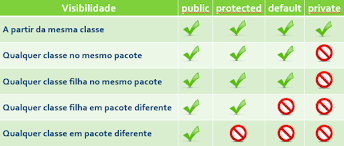
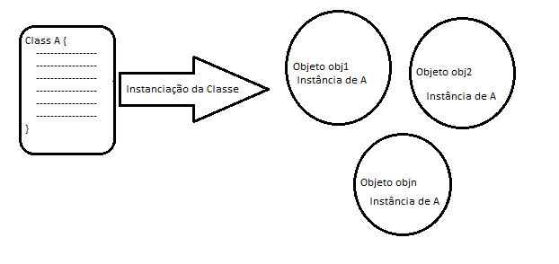

# Pos POO

## Metodos Java

  
    
  

## Modificadores de acesso

- private: somente acessa esse valor na mesma class
- protect: pode acessa o valor em outra class somente do mesmo pacote
- default/nada: nao é visto fora do pacote dele 

  
    
  

## Variaveis de Instancia

  

## Extra
Usar a função sem criar uma instancia do objeto 
(geralmente utilizado quando so vai usar 1 vez a função)
- public static int nameFunction(int param1, int param2 )

 

  

